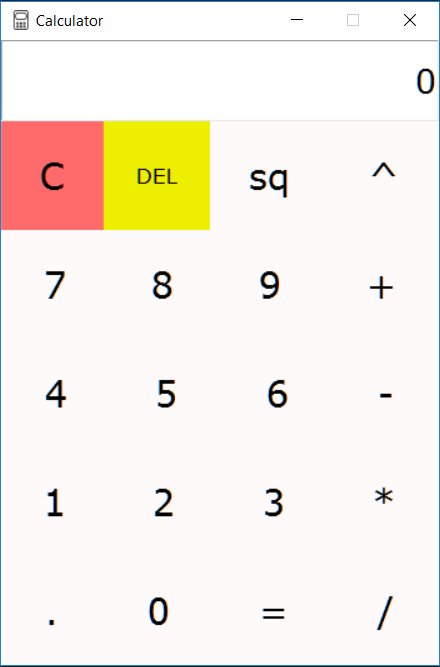

# Calculator
A GUI based calculator developed in python using its inbuilt library Tkinter. 
It can perform basic mathematical computations such as:
- Addition (+)
- Subtraction (-)
- Multiplication (*)
- Division (/)
- Calculating exponent of a number (^)
- Squaring a number (n^2)

*Some icon files are provided in the Icon folder. To change the icon of the application present on the top-left, make changes in the main.py file here: `root.iconbitmap("Icons/<name_of_file>.ico")`

UI of the Application:

 

